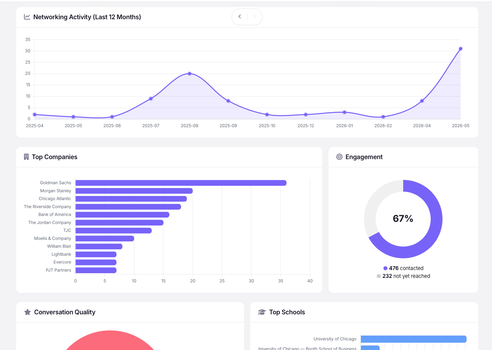
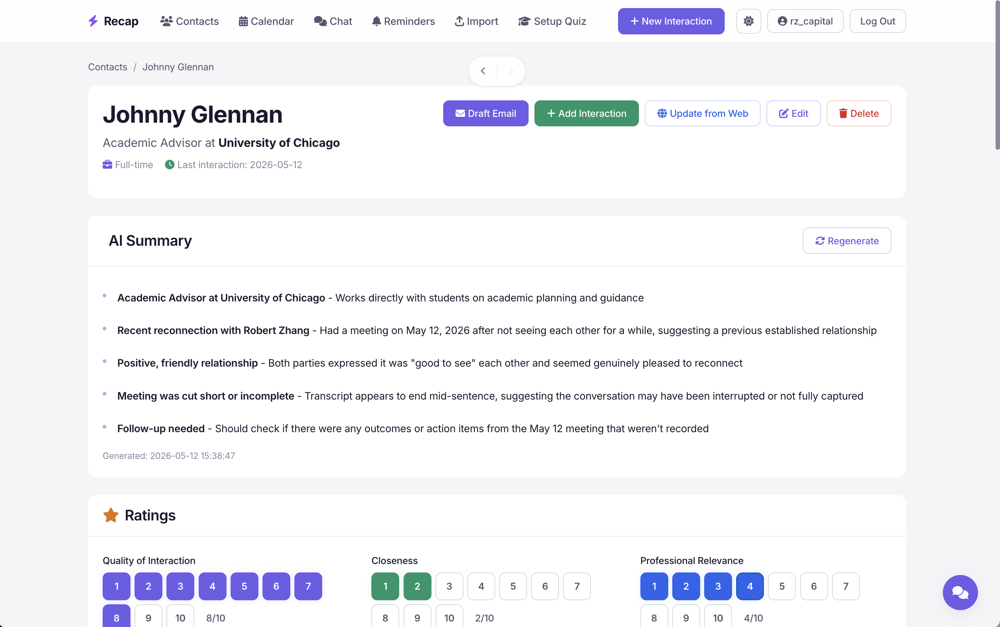
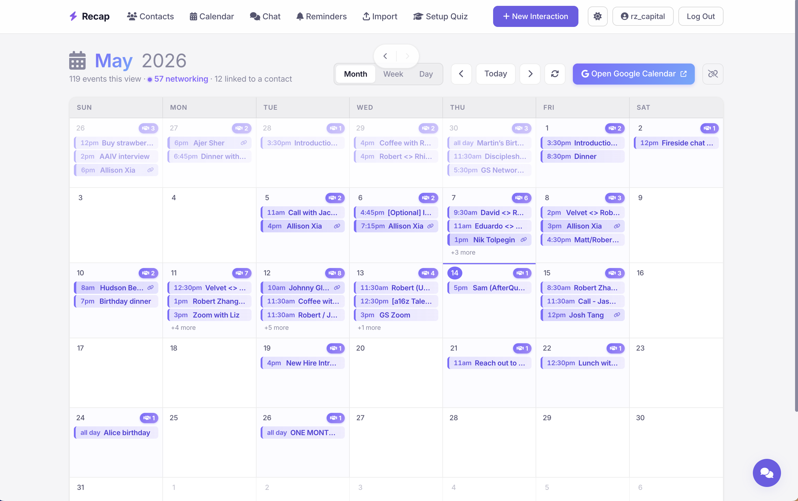
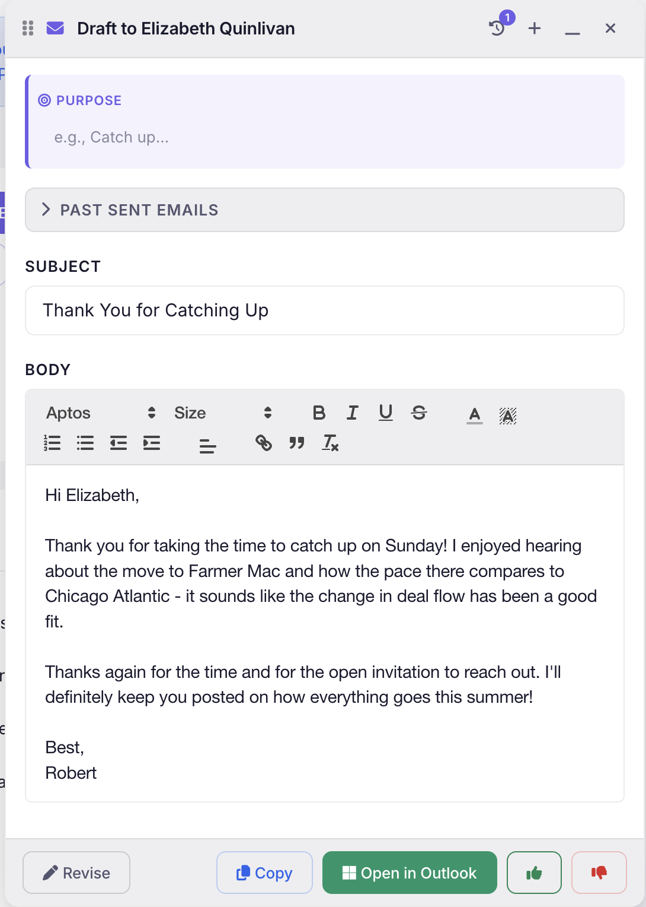
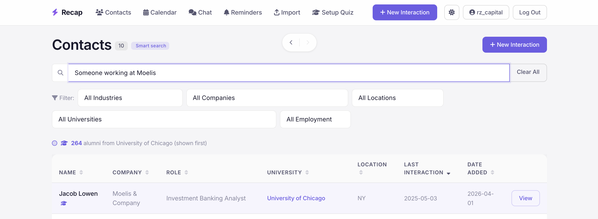
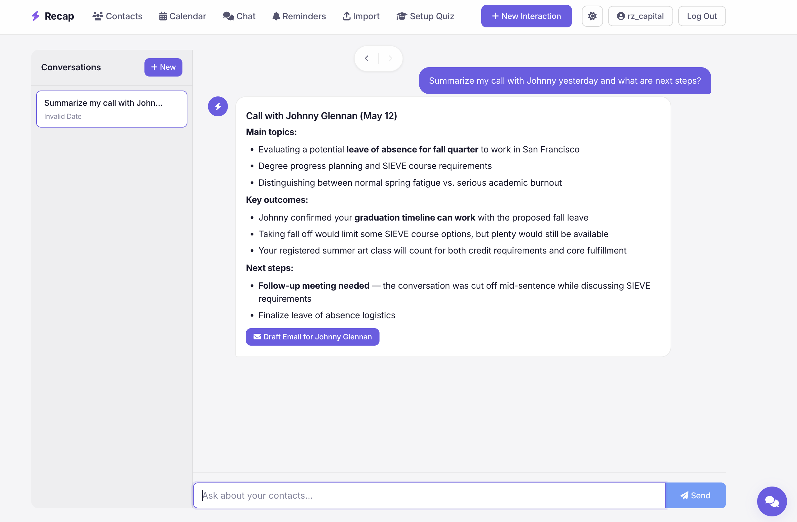
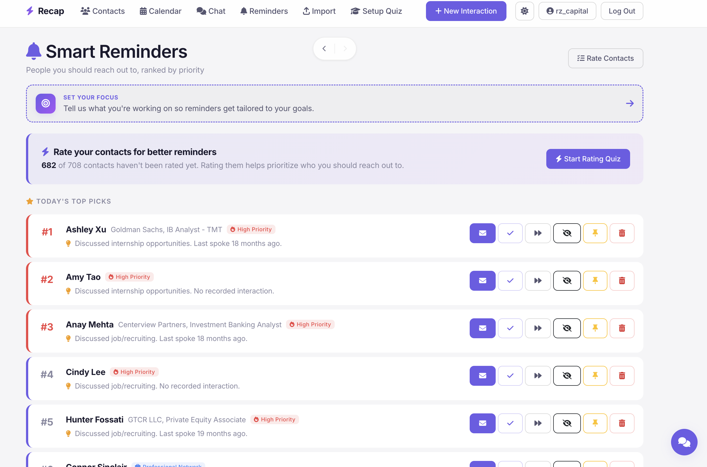
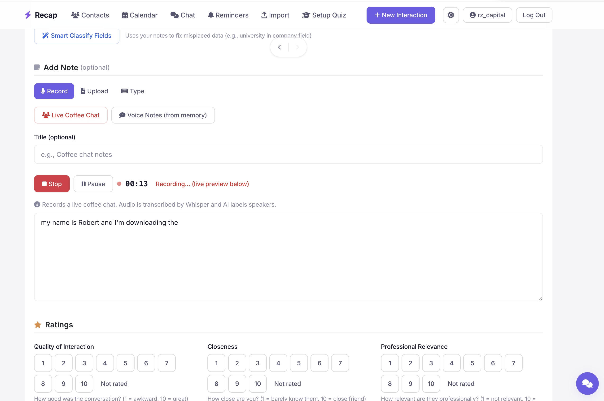

# Recap

**A networker's CRM: record your calls, rate them, draft the follow-up email, sync your calendar, search by what you remember, ask the built-in agent anything, and get automated reminders for who to reach out to next.**

🔗 **Live product:** [recap.network](https://recap.network) (you can sign up and try it)
🔒 **Source code:** Private. Email me for a walkthrough.

---

## What it does

Recap is the full loop around a single networking conversation — from before it happens to weeks after. Five pillars, all in one app:

1. **Record and rate.** Hit record (or upload audio after) for any coffee chat, 1:1, phone screen, or interview. Recap transcribes with speaker diarization, corrects misheard names against your contacts, attaches the transcript to the right person, and prompts you to rate the conversation (quality, closeness, professional relevance).
2. **Email drafting tailored to the call.** Click "Draft Email" and Recap reads the transcript for what you and they actually agreed to — the GitHub link you promised, the August reconnect, the specific role you discussed — and writes a draft that references it. The model learns your voice from your prior approved drafts.
3. **Google Calendar built in.** Recap syncs every calendar you can read (primary + shared + subscribed), filters the month view to networking-only (calls, coffees, interviews, anyone with a name in the title), and lets you jump straight from a meeting into recording or note-taking.
4. **Built-in chat agent.** A tool-using assistant tailored to your network. "Who do I know at Goldman?", "Show me everyone I haven't talked to in 90 days", "Find the founder I met about data labeling" — it queries your contacts, interactions, notes, and calendar to answer.
5. **Automated reminders.** Configurable cadence-based reminders for who to reach out to next, based on your interaction history and closeness ratings. ([Still being built out](#whats-still-being-built) — current version surfaces stale relationships; future versions trigger SMS/email pings.)

Plus: semantic search across contacts, alumni detection, LinkedIn / Excel / Word import, one-click web enrichment with conflict resolution, dashboard analytics, dark/light mode.

---

## Screenshots

### Core flow

**Dashboard — your network at a glance**


**Contact detail — AI summary, formatted notes, ratings, interactions, raw notes, documents**


**Calendar — networking-only month view, synced across all your Google calendars**


**Email drafter — references the actual conversation, learns your voice**


### Power features

**Search — semantic + filterable contact browse**


**Chat agent — ask anything about your network in natural language**


**Reminders — automated nudges for who to follow up with next**


**Live recording — in-browser recording with real-time transcription**


---

## Why it's interesting from an engineering angle

This isn't a course project. It's a real product I use every day and ship to daily. ~18k lines of Python across 19 Flask blueprints and 10 service modules, plus a hand-rolled front end.

### Real ML pipelines, not just "an API call to OpenAI"

- **Two-backend speech-to-text.** A routing layer chooses Deepgram (`nova-3`, with live keyterm biasing built from each user's contact list for better proper-noun recall) or OpenAI Whisper / `gpt-4o-transcribe` as a fallback. Deepgram gives speaker diarization out of the box; for the Whisper path I run a Claude pass to infer speaker turns from context.
- **Three-layer name correction.** Generic STT mishears proper nouns. I correct in three passes: (1) feed contact names as Deepgram keyterms / Whisper prompts for bias, (2) post-pass with Claude to snap misheard tokens to known vocabulary, (3) fuzzy-match the corrected transcript against the user's contact list to attach interactions automatically.
- **Semantic search.** Voyage AI embeddings on contact summaries, stored as `BLOB` in SQLite / `BYTEA` in Postgres, served via top-k cosine. Embeddings rebuild in a background thread the first time a user hits the app post-import.
- **Style-learning email drafts.** When the user approves or edits a draft, I diff the AI output vs. the edited version and extract the user's voice into a structured profile (preferred openers, sign-off shape, banned phrases, tone, length). Three layers — global / per-category / per-contact — compound across approvals so corrections actually stick.
- **Tool-using chat agent.** The in-app assistant has access to typed tools that query contacts, interactions, notes, and calendar. It reasons over what the user actually has, not what it imagines.

### Engineering against AI failure modes

Most of the email-drafting work was making the output behave like a real human's email. A few of the patches (the receipts are in the live product — try it):

- **Deterministic sign-off rewriter.** The model emitted `Best, Robert` on one line, or `Best,Robert` with no space, or just `Best,` with no name. After three rounds of prompt nudging didn't fix it, I gave up and wrote a sanitizer that strips whatever sign-off the model produced and appends a canonical `Best,\nFirstName`. Tested against 13 collapse variants.
- **Quill rich-text editor bug.** Even with a correct `Best,\nRobert` server-side, the front end was rendering it as one line — Quill silently strips `<br>` inside `<p>` when content is assigned via `innerHTML`. Fixed by switching to `clipboard.dangerouslyPasteHTML`, then emitting the sign-off as two adjacent `<p>` tags (the only Quill-safe shape).
- **Date hallucinations.** The model would write "yesterday" for a meeting that happened today. Fixed by injecting `TODAY'S DATE` plus the resolved relative label for the most recent interaction directly into the prompt context.
- **Transcript truncation.** The agreed-upon follow-up (the only thing that matters in a thank-you email) usually lives at the end of the transcript. The original prompt truncated each note to 500 chars. New limit is 6000 chars on the most recent note, with head + tail trimming so the end of the call always survives.
- **Banned-phrase enforcement.** A growing list ("circle back", "I hope this finds you well", em-dashes, "really enjoyed" with dropped subject) is enforced via the system prompt, a separate `BANNED PHRASES` block before the examples, AND again at the very end of the user message so it's the last thing the model reads. Plus a final post-generation sanitizer strips em/en dashes regardless.

### Calendar integration that actually works

Most "Google Calendar in your app" tutorials stop at `events.list` against the primary calendar. Real users have multiple calendars, unchecked sidebars, and timezones that drift.

- Discover every calendar via `calendarList().list(showHidden=True)` and fetch from each, ignoring the visibility checkbox.
- Pass `timeZone=<user's primary cal tz>` so Google returns `dateTime` values already in the user's zone instead of UTC — this fixed a 5-hour display bug.
- De-duplicate events on `iCalUID` (events appearing on multiple calendars), paginate via `nextPageToken`.
- Networking-only filtering in the month view: an event is networking if it has attendees, OR matches a curated keyword list (call, coffee, intro, 1:1, etc.), OR contains a first name from a built-in 400-entry name set (catches "Sam <> Robert" without keywords or attendees).
- 5-minute in-process cache plus hover- and load-time prefetch on prev/next/today navigation, so flipping between days feels instant after the first click.

### Production infra, not just localhost

- **Database adapter** auto-picks SQLite or Postgres based on `DATABASE_URL`. Same SQL with placeholder translation, so the same code runs against a local file and Render Postgres.
- **OAuth + token storage.** Per-user Fernet-encrypted refresh tokens in Postgres. One-time backfill on app startup migrates a legacy single-user `calendar_token.json` into the per-user column.
- **R2 object storage** for uploaded audio / docs in production; local filesystem in dev, abstracted via a `storage.py` adapter.
- **Migrations** run at app boot — idempotent, only add missing columns/tables.
- **Budget enforcement.** Every AI call logs model, latency, tokens, dollar cost, feature name. Over-budget users get a flash and a 429.
- **WebSocket live transcription** via `flask-sock` and a Deepgram streaming client.

### Things I'm proud of as a developer

- **Per-feature analytics out of the box.** I can answer "how much does the median email draft cost?" with one SQL query.
- **No frameworks for the editor.** Quill + Alpine.js + Bootstrap 5 + hand-rolled CSS variables for theming. No React, no build step, no `node_modules`. The whole front end is server-rendered Jinja with sprinkles of Alpine.
- **Defensive prompts.** Every system prompt has explicit `WRONG vs RIGHT` examples for the failure modes I've seen — sign-off formatting, double-enthusiasm phrasing, generic closings on interview emails. Future-me (and future-Claude) gets the lesson without me having to remember.
- **Honest naming.** `_invalidate_ai_artifacts`, `_force_signoff`, `_title_has_person_name`. Function names that say what they do.

---

## Tech stack

| Layer | Tech |
|---|---|
| Backend | Python 3.13, Flask 3, Flask-Login, Gunicorn |
| Database | SQLite (dev), Postgres (prod) |
| AI / ML | Anthropic Claude Sonnet 4.5 (drafting, summaries, chat agent), OpenAI Whisper + GPT-4o-transcribe, Deepgram Nova-3 (live + diarization), Voyage AI (embeddings) |
| Frontend | Server-rendered Jinja2, Alpine.js, Quill (rich text), Bootstrap 5 utilities, hand-rolled CSS |
| Auth | Per-user accounts, Google OAuth 2.0 with encrypted refresh-token storage |
| Storage | Cloudflare R2 (prod), local FS (dev) |
| Realtime | flask-sock WebSockets for streaming transcription |
| Deploy | Render web service + Postgres, Cloudflare DNS + R2, GitHub auto-deploy on push to `main` |

---

## Code snippets (the actual implementation, not pseudo-code)

A few of the more interesting bits, pulled verbatim from the source.

### The deterministic sign-off rewriter

The Claude email-drafting prompt asks for `Best,\nFirstName` (two-line). The model gets it wrong in ~30% of generations. Rather than keep tweaking the prompt, I rewrote the sign-off server-side every time:

```python
def _force_signoff(body: str) -> str:
    """Strip whatever sign-off the model produced and append the canonical
    'Best,\\nFirstName' form. Idempotent."""
    if not body:
        return body
    closing_word = "Best"
    first = (user_first_name or "").strip() or "Best"

    normalized = body.replace("\r\n", "\n").rstrip()
    normalized = re.sub(r"\n{3,}", "\n\n", normalized)
    paragraphs = normalized.split("\n\n")

    def _paragraph_type(p: str) -> str:
        """Classify into: 'name', 'closing', 'signoff', or 'body'."""
        tokens = _paragraph_tokens(p)
        if not tokens or len(tokens) > 4:
            return "body"
        has_name, has_closing = False, False
        for t in tokens:
            low = t.lower()
            if low == (user_first_name or "").lower():
                has_name = True; continue
            if low in SIGNOFF_WORDS:
                has_closing = True; continue
            return "body"
        if has_name and has_closing: return "signoff"
        if has_name: return "name"
        if has_closing: return "closing"
        return "body"

    # Peel trailing non-body paragraphs (any combination of closing word,
    # name, or both). Stop at the first real body paragraph.
    while paragraphs and _paragraph_type(paragraphs[-1]) != "body":
        paragraphs.pop()

    paragraphs.append(f"{closing_word},\n{first}")
    return "\n\n".join(p.rstrip() for p in paragraphs)
```

Tested against 13 collapse variants: `Best,Robert` (no space), `Best, Robert` (one line), `Best Robert` (no comma), `best robert` (lowercase), `Best,\n\nRobert` (extra blank line), etc. All collapse to `Best,\nRobert`.

### Networking-event detection across all calendars

The month view shows only networking events. The classifier ORs three signals together:

```python
def _is_networking(summary: str, attendees: Iterable[dict],
                   keywords: Iterable[str]) -> bool:
    """An event is networking if ANY of:
      1. It has attendees (interpersonal by definition).
      2. The title matches a networking keyword (call, coffee, etc.).
      3. The title contains a person's first name.
    """
    if attendees:
        return True
    s = summary or ""
    if GoogleCalendarClient._matches_keywords(s, list(keywords)):
        return True
    return _title_has_person_name(s)


def _title_has_person_name(summary: str) -> bool:
    """Return True if the title contains a token that matches a known
    first name. Word-boundary-aware: 'Sam <> Robert' matches but
    'samurai' does not."""
    tokens = re.findall(r"[A-Za-z][A-Za-z'\-]+", summary or "")
    return any(t.lower() in _KNOWN_FIRST_NAMES for t in tokens)
```

The `_KNOWN_FIRST_NAMES` frozenset is ~400 US first names, deliberately *excluding* names that double as common English words (May, June, Hope, Pat, Will) to keep false positives low.

### Multi-calendar fetch with timezone handling

```python
def _fetch_raw_events(client, start, end):
    """Fetch every event across all of the user's calendars, including
    secondary / shared / subscribed ones. De-dup on iCalUID."""
    cal_list = client.service.calendarList().list(
        minAccessRole="reader",
        showHidden=True,
        showDeleted=False,
    ).execute().get("items", []) or []

    # Use the primary calendar's timezone so Google returns dateTime values
    # already converted to the user's zone (not UTC).
    user_tz = next(
        (c.get("timeZone") for c in cal_list
         if c.get("primary") or c.get("id") == "primary"),
        "UTC",
    )

    all_items = []
    for cal in cal_list:
        if cal.get("deleted"):
            continue
        cal_id = cal.get("id")
        page_token = None
        while True:
            resp = client.service.events().list(
                calendarId=cal_id,
                timeMin=start.isoformat(),
                timeMax=end.isoformat(),
                timeZone=user_tz,
                singleEvents=True,
                orderBy="startTime",
                maxResults=2500,
                pageToken=page_token,
            ).execute()
            for item in resp.get("items", []) or []:
                item["_source_calendar_id"] = cal_id
                all_items.append(item)
            page_token = resp.get("nextPageToken")
            if not page_token:
                break

    seen = set()
    unique = []
    for ev in all_items:
        key = ev.get("iCalUID") or ev.get("id")
        if key in seen:
            continue
        seen.add(key)
        unique.append(ev)
    return sorted(unique, key=lambda e: (e.get("start") or {}).get("dateTime")
                  or (e.get("start") or {}).get("date") or "")
```

The two non-obvious lines that took the longest to figure out:
- `timeZone=user_tz` — without this, Google returns event times in whatever zone the *event* was created in, which is UTC for events the user didn't author. That's why "Sam <> Robert" showed up at 10pm instead of 5pm before the fix.
- De-dup on `iCalUID`, not `id` — the same event appears multiple times if it's on calendars the user is shared into.

### Anchoring the AI in real time

The email-drafting prompt now injects:

```python
contact_parts.append(f"\nTODAY'S DATE: {today.isoformat()} ({today.strftime('%A')})")
if interactions:
    most_recent = datetime.fromisoformat(
        str(interactions[0]["interaction_date"])[:10]
    ).date()
    delta = (today - most_recent).days
    rel = ("today" if delta == 0
           else "yesterday" if delta == 1
           else f"{delta} days ago (this week)" if 2 <= delta <= 6
           else "last week" if 7 <= delta <= 13
           else f"{delta} days ago" if 14 <= delta <= 30
           else most_recent.strftime("on %B %-d"))
    contact_parts.append(
        f"MOST RECENT INTERACTION: {most_recent.isoformat()} - "
        f"that is {rel} relative to today. When referencing this "
        f"meeting in the email, use exactly this relative wording "
        f"('{rel}') or the literal date - DO NOT invent a different "
        f"relative time."
    )
```

Before this, the model would write "yesterday" for a meeting that happened today because that's the most common training pattern.

---

## Architecture (one-paragraph version)

Server-rendered Flask app with a thin Alpine.js layer for reactivity on a few interactive panels (the email drafter, the contact detail page, the calendar). Database calls go through a thin adapter that auto-picks SQLite or Postgres by `DATABASE_URL`, with placeholder translation so the same SQL strings work on both. AI logic lives in `services/` — each service is a stateless module that takes a DB connection + config and returns plain data, which keeps routes thin. Storage is abstracted so dev uses local files and prod uses R2 without code changes. Auth is per-user with Google OAuth for calendar access, refresh tokens encrypted at rest. Deploys run as a single Gunicorn web service on Render with Postgres alongside; GitHub auto-deploys on push to `main`.

See `ARCHITECTURE.md` for the longer version.

---

## What's still being built

I ship this daily, so things are always in motion. A few things on the active roadmap:

- **Reminders v2.** Current version surfaces stale relationships in the UI. The next iteration triggers automated SMS / email pings based on per-contact cadence rules and your closeness rating.
- **Multi-account Google.** Right now Recap reads one connected Google account. Users with a personal + work Gmail want both — straightforward extension of the existing OAuth code.
- **Voice-driven note review.** Read back the AI summary aloud and let the user accept / edit / regenerate by voice. Useful for between-meeting downtime.

---

## About me

Robert Zhang — University of Chicago. Recruiting for startup software / ML engineering internships. I build things people actually use.

- Live product: [recap.network](https://recap.network)
- GitHub: [@robertzhang5](https://github.com/robertzhang5)
- Email: open an issue here or DM me on LinkedIn

If you're a recruiter and want to walk through the private source code, **email me and I'll add you as a read-only collaborator** on the main repo. Most interesting files to skim are:
- `webapp/services/ai_service.py` — prompt engineering, sanitizers, style profiles (~2000 lines)
- `webapp/services/calendar_service.py` — multi-calendar fetch, timezone handling, networking filter
- `webapp/services/transcription_service.py` + `deepgram_client.py` — speech pipeline
- `webapp/services/style_profile_service.py` — how the email-style learning compounds
- `webapp/services/chat_service.py` — the tool-using assistant over your network

Happy to walk through any of it.
